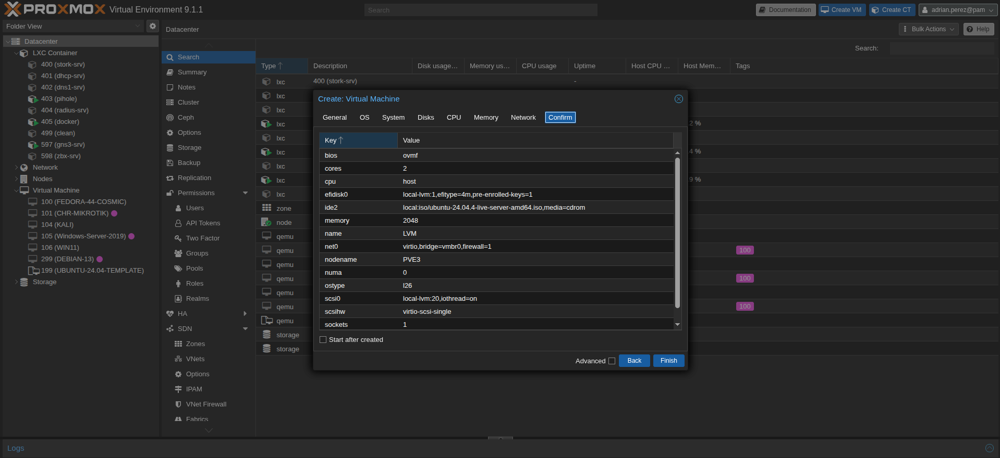
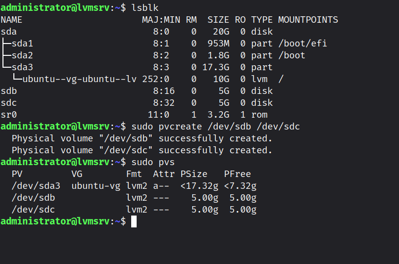
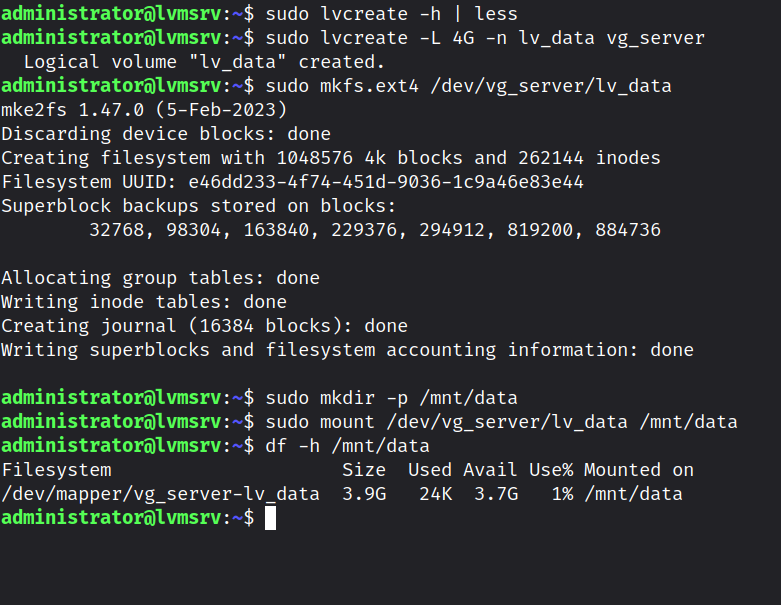
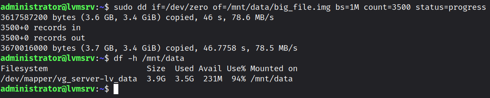
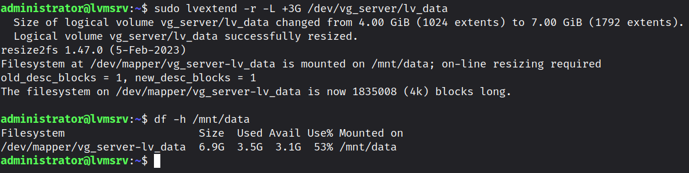
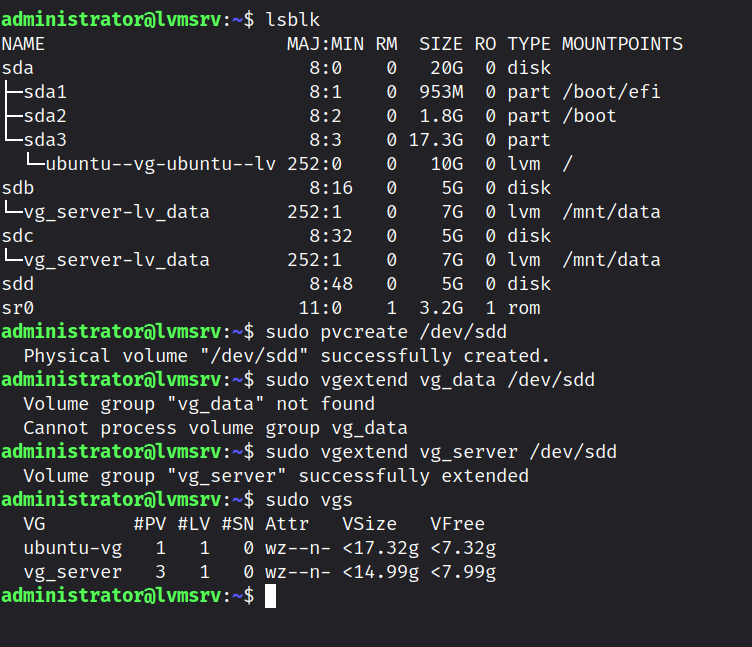
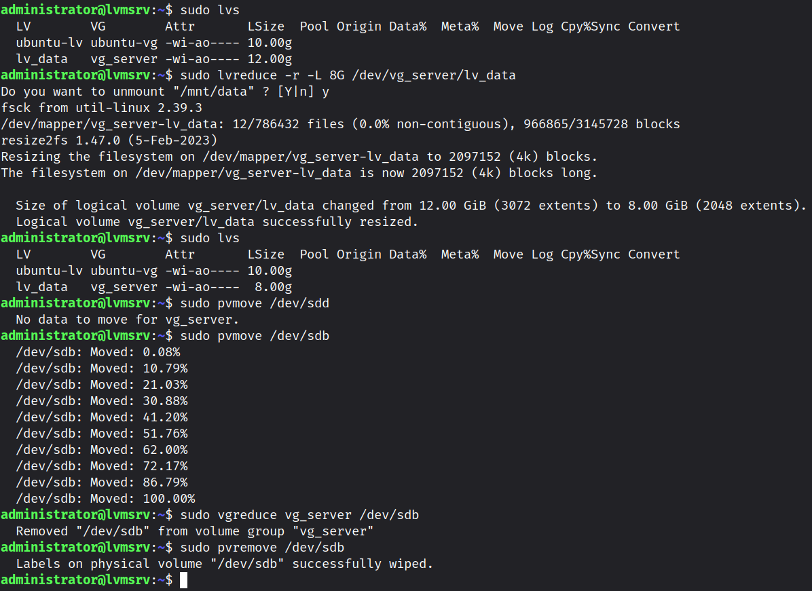
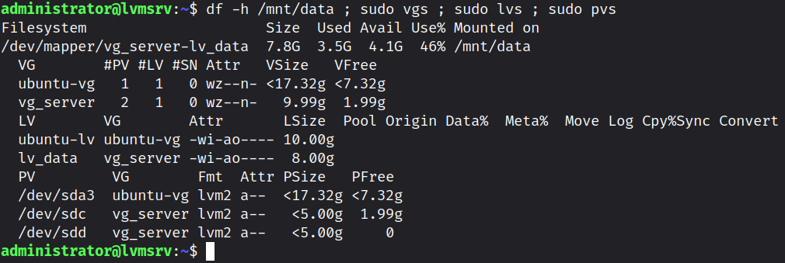

**LVM Storage Management & Hot-Expansion Lab**
This technical lab demonstrates advanced Linux storage management using **Logical Volume Manager (LVM)** on an **Ubuntu Server 24.04 LTS** virtual machine hosted on **Proxmox VE.**

## Overview
In enterprise Linux Environments, storage demands fluctuate unpredictably. Traditional partitioning schemes require service downtime or risky table alterations to scale. **Logical Volume Manager (LVM)** abstracts physical storage devices into flexible virtual pools, allowing System Administrators to resize dynamically without interrupting active services (*Zero Downtime*).

This project simulates a complete storage lifecycle in a real-world infrastructure scenario: Provisioning storage, handling a storage exhaustion event, dynamically extending pools, reducing logical volumes, and safely decommissioning physical disks.

## **Core Objectives:**
1. **Hierarchical Setup:** Configuring a complete multi-tier LVM architecture consisting of Physical Volumes (PV), Volume Groups (VG), and Logical Volumes (LV).
2. **Zero-Downtime Hot-Expansion:** Resolving storage exhaustion crises y introducing new physical disks and extending the filesystem online without service interruption.
3. **Safe Disk Evacuation & Voulme Reduction:** Executing block-level migrations to safely reduce logical volume capacity and decommission physical drives with zero data loss.

## Infrastructure & Architecture Overview
- **Hypervisor:** Proxmox VE.
- **Operating System:** Ubuntu Server 24.04 LTS
- **Storage Layout:**
	- /dev/sda (20 GB): System OS disk (EFI, /boot, base LVM ubuntu-vg).
	- /dev/sdb (5 GB): Secondary disk 
	- /dev/sdc (5 GB): Secondary disk
	- /dev/sdd (5 GB): Hot-added tertiary disk
   

### 1: Storage Inspection & Physical Volume Initialization
Upon attaching secondary disks /dev/sdb and /deb/sdc to the virtual machine, inspect the available block devices:
```
lsblk
```

Initialize the clean block devices as LVM Physical Volumes (PV):
```
sudo pvcreate /dev/sdb /dev/sdc
```
Verify PV creation:
```
sudo pvs
```


### Phase 2: Volume Group & Logical Volume Provisioning
Combine the two 5 GB physical volumes into a single 10 GB Volume Group named vg_server
```
sudo pvcreate vg_server /dev/sdb /dev/sdc
```

Create a 4 GB Logical Volume named lv_data inside vg_server, format it with the ext4 filesystem, and mount it to /mnt/data.
```
# Create Logical Volume
sudo pvcreate -L 4G -n lv_data vg_server

# Format filesystem
sudo mkfs.ext4 /dev/vg_server/lv_data

# Create mount point and mount
sudo mkdir -p /mnt/data
sudo mount /dev/vg_server/vl_data /mnt/data
```
Confirm mount point and capacity:
```
df -h /mnt/data
```


### Phase 3: Live Storage Simulation & Hot-Extension

**1. Simulating Storage Pressure**
To emulate a critical database grown event, a 3.5 GB dummy file is generated on the volume:
```
sudo dd if=/dev/zero of=/mnt/data/large_file.img bs=1M count=3500 status=progress
```
Checking utilization reveals ~90% capacity usage:
```
df -h /mnt/data
```


**2. Live Expansion (Zero Downtime)**
Using available unallocated space within vg_server (which currently has 6 GB free), extend lv_data by +3 GB. The -r (resizefs) flag automatically expands the underlying ext4 filesystem on the fly without unmounting:
```
sudo lvextend -r-L +3G /dev/vg_server/lv_data
```
Verify filesystem expansion:
```
df -h /mnt/data
sudo lvs
```


### Phase 4: Scaling Storage Beyond Pool Limits (Hot-Adding Hardware)

#### 1. Scenario
The volume requires an additional **5 GB** increment (expanding from 7 GB to 12 GB), but 'vg_server' only has 3 GB of remaining unallocated space.

#### 2. Solution: Hot-Adding Physical Media

1. Attach a new 5 GB virtual disk ('/dev/sdd') via Proxmox VE without shutting down the VM.
2. Initialize '/dev/sdd' as a Physical Volume:
```
	sudo pvcreate /dev/sdd
```
3. Extend 'vg_server' to integrate '/dev/sdd':
```
sudo vextend vg_server /dev/sdd
```
4.  Extend 'lv_data' to 12 GB an resize the filesystem simultaneously:
```
sudo lvextend -r -L +5GB /dev/vg_server/lv_data
```


### Phase 5: Volume Reduction & Safe Physical Disk Decommissioning
In enterprise maintenance, removing a physical disk without data loss requires evacuating data blocks to remaining disks before unlinking.

### 1. Reducing Volume Capacity
To allow removing a 5 GB disk, reduce the logical volume and filesystem from 12 GB to 8 GB (ensuring the 3.5 GB of active data fits into the remaining 10 GB pool):
```
sudo lvreduce -r -L 8G /dev/vg_server/lv_data
```

### 2. Evacuating Data Blocks
Migrate all data extents away from '/dev/sdb' to available physical extents on '/dev/sdc' and '/dev/sdd':
```
sudo pvmove /dev/sdb
```

### 3. Removing the Physical Volume from the VG
Once '/dev/sdb' is empty,  safely detach it from the Volume Group and wipe its LVM signatures:
```
# Detach PV from Volume Group
sudo vgreduce vg_server /dev/sdb

# Clear LVM metadata from disk
sudo pvremove /dev/sdb
```

## Final State Verification
Execute a consolidate check across all LVM abstraction layers:
```
df -h /mnt/data ; sudo vgs ; sudo lvs ; sudo pvs
```


### Expected Output Summary
**Filesystem ('df -h'):** '/mnt/data' mounted at 7.8 GB with \~3.5 GB used and zero data loss.
**Volume Group ('vgs'):** 'vg_server' total size \~9.99 GB across **2 active PVs** ('#PV = 2').
**Logical Volume ('lvs'):** 'lv_data' active at 8.00 GB.
**Physical Volumes ('pvs'):** '/dev/sdc' and '/dev/sdd' active; '/dev/sdb' completely removed.


## Key Technical Takeaways
* **Decoupling Hardware:** LVM separates physical storage boundaries from OS filesystem limits.
* **Online Resizing:** The '-r' flag with 'lvextend'/'lvreduce' handles filesystem boundaries changes on the fly.
* **Dynamic Migration:** 'pvmove' enables seamless live disk replacement without unmounting volumes or stopping services
